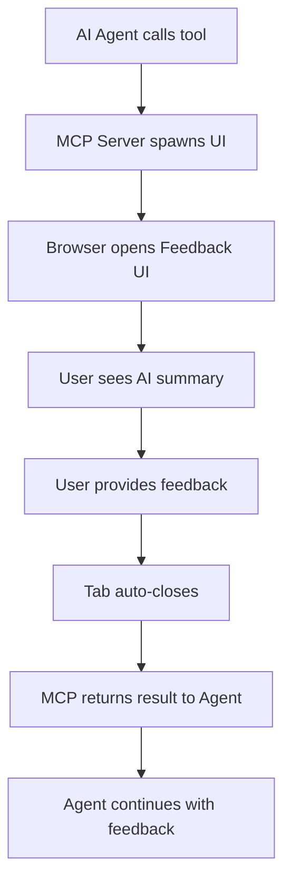

# 🤖 Interactive Feedback Workflow

## 🎯 Overview

Hệ thống interactive feedback cho phép AI agent thu thập phản hồi từ user thông qua giao diện web đẹp mắt. Workflow này được thiết kế để:

- **📋 Agent báo cáo** những gì đã làm
- **🌐 Mở web UI** để user xem và phản hồi
- **⏳ Wait for user response** (blocking call)
- **✅ Return feedback** về cho agent để tiếp tục

## 🔄 Complete Workflow



## 🚀 Quick Start

### 1. Setup MCP Server trong Editor

Thêm vào editor config (VSCode/Cursor/Windsurf):

```json
{
  "mcpServers": {
    "interactive-feedback": {
      "command": "node",
      "args": ["src/mcp-lightweight.js"],
      "cwd": "/path/to/interactive-feedback-mcp-v2"
    }
  }
}
```

### 2. Agent Usage

Agent sử dụng tool như sau:

```javascript
// Agent calls tool
const result = await callTool('interactive_feedback', {
  project_directory: '/path/to/project',
  summary: 'I implemented the new login feature with JWT auth...',
})

// MCP server waits for user feedback
// Browser opens automatically
// User provides feedback
// Result contains user's response

console.log(result.interactive_feedback) // User's actual feedback
```

### 3. User Experience

Khi tool được gọi:

1. **🌐 Browser tự động mở** với feedback UI
2. **📝 UI hiển thị**:
   - Project directory
   - AI summary (những gì agent đã làm)
   - Feedback form
3. **💬 User nhập feedback**:
   - "Implementation looks good, proceed"
   - "Please add error handling for edge case X"
   - "The approach is wrong, try method Y instead"
4. **✅ User clicks Submit**
5. **🔄 Tab tự động đóng**
6. **🎯 Agent nhận được feedback và tiếp tục**

## 📝 Example Scenarios

### Scenario 1: Code Review

```
Agent: "I implemented user authentication with bcrypt and JWT.
        Created login/register endpoints with input validation."

User Feedback: "Good work! Please also add rate limiting
                to prevent brute force attacks."

Agent: "Thanks for the feedback! I'll add rate limiting now."
```

### Scenario 2: Feature Request

```
Agent: "I added the shopping cart functionality with
        add/remove/update operations and persistence."

User Feedback: "The cart works but please add quantity
                validation and stock checking."

Agent: "I'll implement quantity validation and stock checking now."
```

### Scenario 3: Bug Fix

```
Agent: "I found the performance issue was in the database query.
        Added indexing and query optimization."

User Feedback: "Performance improved but now there's a bug
                with user permissions. Can you check?"

Agent: "I'll investigate the permissions issue right away."
```

## 🧪 Testing

Test complete workflow:

```bash
# Test MCP tool với interactive feedback
node configs/test-feedback-workflow.js
```

Hoặc test UI server trực tiếp:

```bash
# Test feedback UI standalone
node src/feedback-ui-server.js --project-directory . --summary "Test feedback"
```

## 🎨 UI Features

Feedback UI bao gồm:

- **📱 Responsive design** - hoạt động trên mobile/desktop
- **🎯 Clean interface** - tập trung vào feedback
- **⌨️ Keyboard shortcuts** - Ctrl+Enter để submit
- **🔄 Auto-close** - đóng tab sau khi submit
- **📊 Real-time updates** - WebSocket connection
- **🎨 Beautiful styling** - gradient backgrounds, smooth animations

## 🔧 Configuration

### Environment Variables

```bash
# Optional: Set logging level
export MCP_LOG_LEVEL=info

# Optional: Set Node.js options
export NODE_OPTIONS="--no-warnings"
```

### Editor Timeout Settings

```json
{
  "timeout": 60000, // 60 seconds
  "NODE_ENV": "production"
}
```

## 📊 Workflow Benefits

- **🎯 Focused feedback** - dedicated UI cho feedback
- **⏳ Synchronous flow** - agent waits for real user input
- **🔄 Complete loop** - từ agent → UI → user → agent
- **📱 Better UX** - đẹp hơn terminal prompts
- **🚀 Fast startup** - lightweight server
- **🔒 Secure** - local-only connections

## 🛠️ Technical Details

### File Structure

```
src/
├── server/mcp-server.js      # Main MCP server với feedback logic
├── feedback-ui-server.js     # Standalone feedback UI server
└── mcp-lightweight.js        # Lightweight MCP entry point

public/
└── feedback-ui.html          # Feedback UI interface

configs/
└── test-feedback-workflow.js # End-to-end test
```

### Process Flow

1. **MCP Server** spawns `feedback-ui-server.js`
2. **UI Server** starts Express + WebSocket server
3. **UI Server** opens browser to feedback page
4. **User** interacts với feedback form
5. **UI Server** saves result to temp file và exits
6. **MCP Server** reads result từ temp file
7. **MCP Server** returns result to agent

### Communication

- **Process spawn** - MCP ↔ UI Server
- **Temp files** - result sharing
- **WebSocket** - real-time UI updates
- **HTTP** - feedback form submission

---

**🎉 Enjoy the enhanced AI-human collaboration workflow!**
